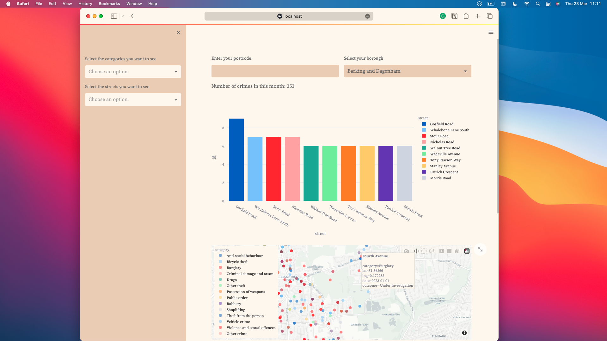

# Uk Crime Map



Web app that show the crime data relative to a specific location.

It's been deployed: https://robsca-crime-map-app-xq9yp1.streamlit.app


### Setup

If you want to run the app locally, you need to install the requirements and run the app with streamlit.

```bash
virtualenv venv -p python3
source venv/bin/activate
pip install -r requirements.txt
streamlit run app.py
```